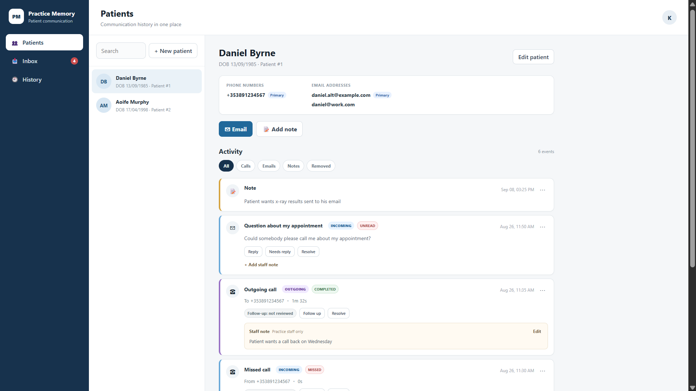
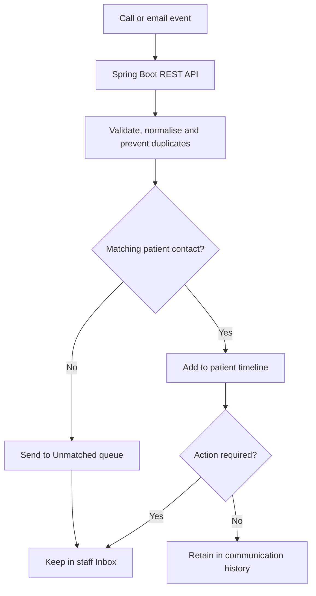
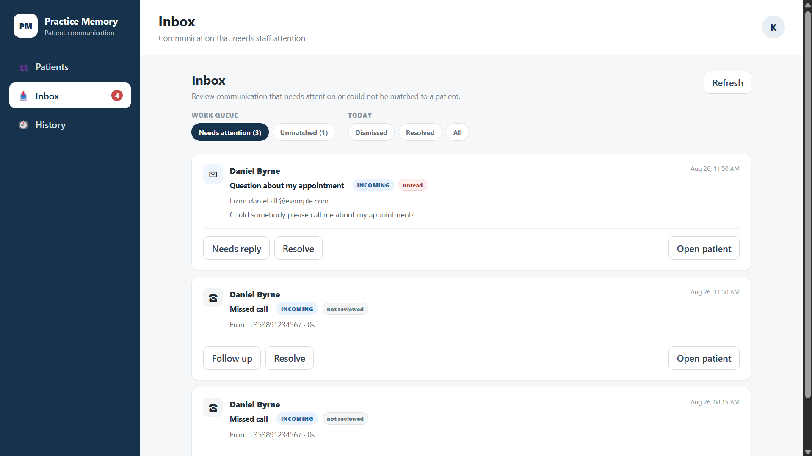
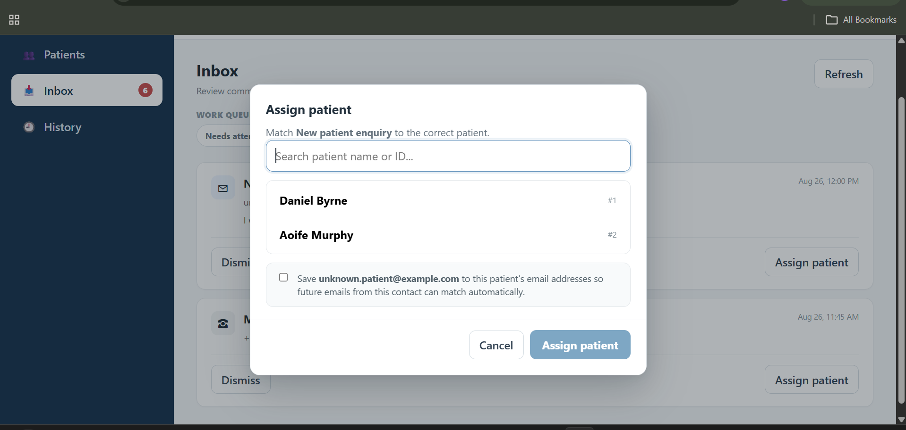

# Practice Memory

Practice Memory is a full-stack communication workflow prototype for small practices. It links calls, emails and staff notes to a patient, gives staff one chronological history, and keeps unresolved work in a focused inbox.

I built the MVP after discussing the day-to-day workflow with a practice administrator. The goal was to test whether automatic communication logging and clearer follow-up tracking could reduce missed or duplicated callbacks without replacing the practice's existing software.

> **Project status:** portfolio/pilot MVP. The repository is configured for local development with fake data and is not a production system for real patient information.
## Interface



*Unified patient timeline containing calls, emails and staff notes. All information shown is fictional demo data.*

## How the workflow works

1. Incoming and outgoing call events are received through provider-neutral REST endpoints. For the local prototype, these events are simulated using Postman. Emails can be ingested through REST endpoints or the optional mailbox connection.
2. The Spring Boot backend validates each event, normalises the phone number or email address and protects against duplicate records. Related call events are correlated using `providerCallId`, while email replies can be linked using message headers.
3. The system searches the stored patient contact details for a matching phone number or email address.
4. When a match is found, the communication is automatically added to that patient’s chronological activity timeline.
5. When no match is found, the communication is preserved in the Unmatched queue for staff to review and assign.
6. Missed calls, unanswered outgoing calls and unread emails enter the Inbox and remain there until staff resolve or dismiss them.



> The MVP provides the provider-neutral call ingestion API. Connecting it to a particular telephone provider would require a provider-specific adapter.

## Key workflows

### Follow-up work queue

Missed calls, unanswered outgoing calls and emails requiring a response remain visible in the Inbox until a member of staff resolves or dismisses them.



### Unmatched communication assignment

Communications from unknown contact details are preserved instead of being assigned by guesswork. Staff can match an item to the correct patient and optionally save the new contact detail so future communications match automatically.



## What it does

### Patient and contact management

- Create, search and edit patients.
- Search by name, date of birth, patient number, phone number or email address.
- Store multiple phone numbers and email addresses with a primary contact.
- Deactivate a contact for future matching while preserving its historical communications.

### Call workflow

- Accept incoming and outgoing call events through a provider-neutral REST API.
- Correlate repeated provider events to one call lifecycle using `providerCallId`.
- Normalise phone numbers before matching them to a patient.
- Preserve matched, unmatched, ambiguous and withheld-number calls.
- Track missed calls, no-answer attempts, optional notes and follow-up state.
- Assign unmatched calls to a patient and optionally save the number for future matching.

### Email workflow

- Store inbound and outbound email activity.
- Optionally send through SMTP and import received mail through IMAP.
- Match replies using `Message-ID` and `In-Reply-To` before falling back to sender matching.
- Assign unmatched messages, add staff notes and track messages requiring action.

### Inbox, history and auditability

- Keep **Inbox** as a work queue for items that still need attention.
- Keep **History** as a separate activity explorer with date, type, outcome and workflow filters.
- Show a unified patient timeline containing calls, emails and standalone staff notes.
- Dismiss, restore and remove activity non-destructively instead of deleting the underlying record.

## Engineering highlights

- Layered Spring application: controller → service → repository → database.
- Direction-aware phone matching: caller for inbound calls, destination for outbound calls.
- Idempotent provider-event handling with protection against late lifecycle events overwriting terminal outcomes.
- Separate state models for patient matching, communication outcome, follow-up and triage.
- DTO-based API boundaries with validation and central exception handling.
- File-backed H2 database for a zero-setup local demo and in-memory H2 databases for integration tests.
- React/TypeScript interface backed by typed API modules.

See [ARCHITECTURE.md](ARCHITECTURE.md) for the domain model and request flows, and [CALL_INTEGRATION.md](CALL_INTEGRATION.md) for the provider adapter contract.

## Technology

| Layer | Technology |
| --- | --- |
| Backend | Java 21, Spring Boot 4.1, Spring MVC |
| Persistence | Spring Data JPA, Hibernate, H2 |
| Email | Spring Mail, Jakarta Mail, SMTP/IMAP |
| Frontend | React 19, TypeScript, Vite |
| Tests | JUnit, Spring Boot Test, MockMvc, Mockito |

## Run locally

### Prerequisites

- JDK 21
- Node.js 20.19+ or 22.12+
- npm

### 1. Start the backend

Windows PowerShell:

```powershell
.\gradlew.bat bootRun
```

macOS/Linux:

```bash
./gradlew bootRun
```

The API starts at `http://localhost:8000`. The default profile does not connect to a real mailbox.

### 2. Start the frontend

In a second terminal:

```bash
cd frontend
npm ci
npm run dev
```

Open `http://localhost:5173`. Vite proxies `/api` requests to the backend on port `8000`.

The local database is created under `data/` and is excluded from Git. Use fake information when exploring the application.

## Checks

Backend tests:

```bash
./gradlew test
```

On Windows, use `./gradlew.bat test` in PowerShell.

Frontend type-check and production build:

```bash
cd frontend
npm ci
npm run build
```

Frontend lint:

```bash
cd frontend
npm run lint
```

## Main API routes

| Route | Purpose |
| --- | --- |
| `POST /api/patients` | Create a patient and optional primary contacts |
| `GET /api/patients` | Search/list patients |
| `POST /api/calls/events` | Ingest a provider-neutral call lifecycle event |
| `POST /api/calls/incoming` | Convenience endpoint for an inbound call |
| `POST /api/calls/outgoing` | Convenience endpoint for an outbound call |
| `GET /api/inbox` | Load communications requiring attention |
| `POST /api/emails/incoming` | Ingest an inbound email event |
| `GET /api/patients/{id}/activity` | Load a patient's chronological activity |

## Optional email connection

Email integration is disabled in the normal development profile. Copy the example values from `.env.example`, supply your own environment variables, and activate the `email` Spring profile only when testing with a compatible mailbox.

Full setup and provider caveats are documented in [EMAIL_SETUP.md](EMAIL_SETUP.md). Never commit mailbox credentials or local `.env` files.

## Current boundaries

- A phone-provider-specific adapter is intentionally not included; the core accepts a neutral call-event contract that an adapter can target.
- Authentication, role-based permissions, HTTPS, production migrations, backups and deployment infrastructure are outside this local MVP.
- The included H2 configuration is for development and demonstration only.
- The project does not contain real patient data, production credentials or call audio.

## Project structure

```text
src/main/java/com/brendan/practicememory/
  activity/       patient timelines, inbox and audit events
  call/           call lifecycle, matching and follow-up
  email/          email ingestion, sending and reply matching
  patient/        patient and contact management
  shared/         validation, normalisation and shared triage logic

frontend/src/
  api/             typed API clients
  App.tsx          application state and interface
  App.css          application styling
```

## Author

Built by Brendan Sibanda as a full-stack product and workflow-validation project.
